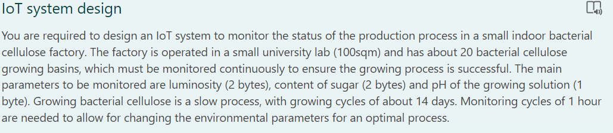
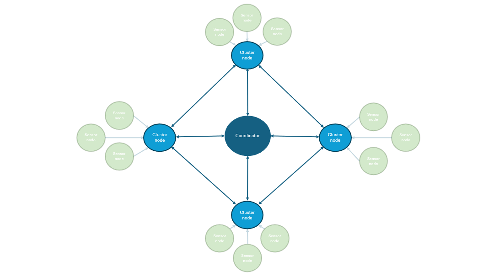

<script type="text/javascript" 
  src="http://cdn.mathjax.org/mathjax/latest/MathJax.js?config=TeX-AMS-MML_HTMLorMML">
</script>
<script type="text/x-mathjax-config">
  MathJax.Hub.Config({ tex2jax: {inlineMath: [['$', '$']]}, messageStyle: "none" });
</script>



### **Q1 ~ propose an overall design for the system, mainly focusing on the communication technology to be used. Motivate your choice** <br><br>


Measuring the states of each cellulose growing basins is a business-critical activity; guaranty performance, reliability error avoidance and recovery, must be our main goals. <br>
Consequently a battery-powered device is not advised to achieve sufficient reliability, even if it were possible to guarantee an autonomy of 14 days (or more) a non-swift battery replacement can delay required reactions to critical states causing the loss of 1 growing basin.<br>
Moreover, the direct power supply makes avoiding duty cycles (with deep sleep periods) possible, allowing researchers to require additional data asynchronously.
Since growing bacterial cellulose, as described, is a slow process, as default each basin will communicate its state once an hour, consequently allowing researchers to request additional data can be appropriate.<br>

**Peripheral network (very short range):**
<br>
The peripheral network is characterized by a very short distance between actors (sensor and cluster nodes), so it can be easily implemented through wired protocols. <br>
Each basin measure device comprises 3 independent sensor nodes (to enable error avoidance and simplify maintenance) connected to a cluster node through PoE (power over ethernet). the sensor nodes respectively measure the luminosity, sugar, and pH of the growing solution, they are programmed to perform 3 data measurements and send it to the cluster node as soon as they receive power.<br>
The cluster node act as a CoAP server, it's indipendently connected to each senor node throught ethernet connectivity (no possible collisions in this stage, ACK is not required) and it also provide power supply (turning on the device only when it require data). Its role is to aggregate senor data into a single message (each sensor perform multiple reading to mitigate measurements errors, and send one CoAP post request for each reading) and send it to the coordinator.<br>
>**note:** This configuration allows sensor redundancy, if we attach multiple identical sensors to a cluster node, if (after raising power up) the main sensor does not respond (providing data) the cluster will ask data to the backup sensor.

>**note:** In this configuration the cluster node is a single point of failure, it must be highly reliable.

**Main network (short range):**
<br>
Due to the longer distances the main network needs to be wireless, based on Zigbee (frequency-band: 2.4GHz, bit rate: 250kb/s). Zigbee has a theoretical max distance range of 100 m, and so for our implementation is required to use mesh topology to extend the max reachable distance (all the cluster nodes are full-function devices and can contribute to the mesh creation).<br>
As already said the implementation focus is on reliability, so the Zigbee network must run in Beacon Enabled mod to avoid collisions (with CAP time equal to zero), once an hour the coordinator will send a beacon and will receive updated data from each of the 20 cluster nodes; each cluster node will provide all the data in a single message with a fixed data length of 5 Bytes (the whole messages stays in a single packet with the standard size of 128 Bytes), the CFP time can be computed as follows:
$$ T_{CFP} = 20\cdot(\dfrac{128\cdot8}{250\cdot10^3}) \simeq 0,082s$$
>**note:** cluster nodes aren't power constricted and can take the Zigbee antenna powered during sleeping phases to receive asynchronous data requests from the coordinator.

>**note:** the coordinator can run Zigbee2MQTT open protocol to achieve cloud independence, publishing each data coming from a cluster nod to its specific MQTT topic.

### **Q2 ~ write the pseudocode of the firmware that should be run by the monitoring device installed on each basin**
Pseudocode for sensor nodes:
  ```
  void setup() {
    for(int i = 0; i<3; i++){
        sensorData = doSensorRead();
        CoAPPost(sensorDat);
    }
  }
  ```
Pseudocode for clusterNode nodes (with redundancy):
  ```
  void onBeaconRecv(beaconMsg){
    aggregatedData = Struct{
        float luminosity;
        float sugar;
        float ph;
    }

    for(sensor in luminositySensorList){
        try{
            aggregatedData.luminosity = average(sensor.getMeasure()); //provide power to the sensor and wait for data returned as a list, raise an exception if the sensor does not respond
            break;
        }catch{
            //communicate sensor failure
        }
    }

    //same for other sensor types

    sendZigbeeMSG(aggregatedData);
  }
  ```
### **Q3 ~ as an add-on, you are required to install a VGA camera (640x480 pixels, 8 bits per pixel) to monitor the status of the growing process. Is the solution proposed at the previous points still valid? If not, propose an alternative solution.**

The peripheral network can be maintained identically, by simply adding the VGA camera as a new sensor node. However the same can't be said for the main network, in fact ZigBee is not designed for high traffic and continuous communication, in this case, WiFi is a better way to go. <br>
Alternativelly we can keep the previous network unchanged plugging the 20 cameras directly to the coordinator with a dedicate network wired (ethernet), or wirless (WiFi).
>**note:** in the second case, particular attention is required to avoid interference, WiFi and Zigbee work on the same frequency-band (2.4 Ghz), channels must be seated properly.